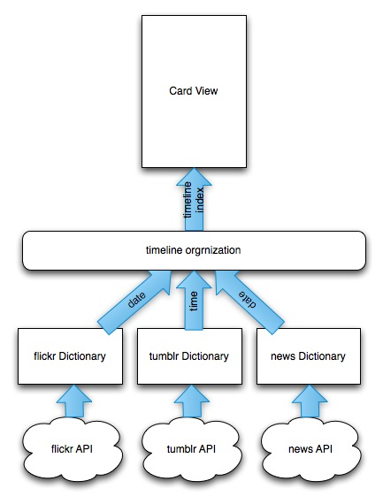

# iOSYahooBoard

### Features
A nonstop flowview include flickr, tumblr & news etc. Just like Flipboard

### Model

###Reference

####Tumblr
- Retrieve  video and photo info
- https://www.tumblr.com/docs/en/api/v2#photo-posts
- api.tumblr.com/v2/blog/{base-hostname}/posts[/type]?api_key={key}&[optional-params=]

- Retrieve Blog Info
- api.tumblr.com/v2/blog/{base-hostname}/info?api_key={key}

- OAuth
- Request-token URL   http://www.tumblr.com/oauth/request_token
- Authorize URL   http://www.tumblr.com/oauth/authorize
- Access-token URL    http://www.tumblr.com/oauth/access_token
- [TMTumblrSDK](http://cocoapods.org/pods/TMTumblrSDK)
####Fliker 

- https://www.flickr.com/services/api/
- auth.oauth api
- galleries api
- photos api
- photos.comments api
- [Objectiveflickr] (https://github.com/lukhnos/objectiveflickr)

####News
- News API
- http://www.alchemyapi.com/api/newsapi
